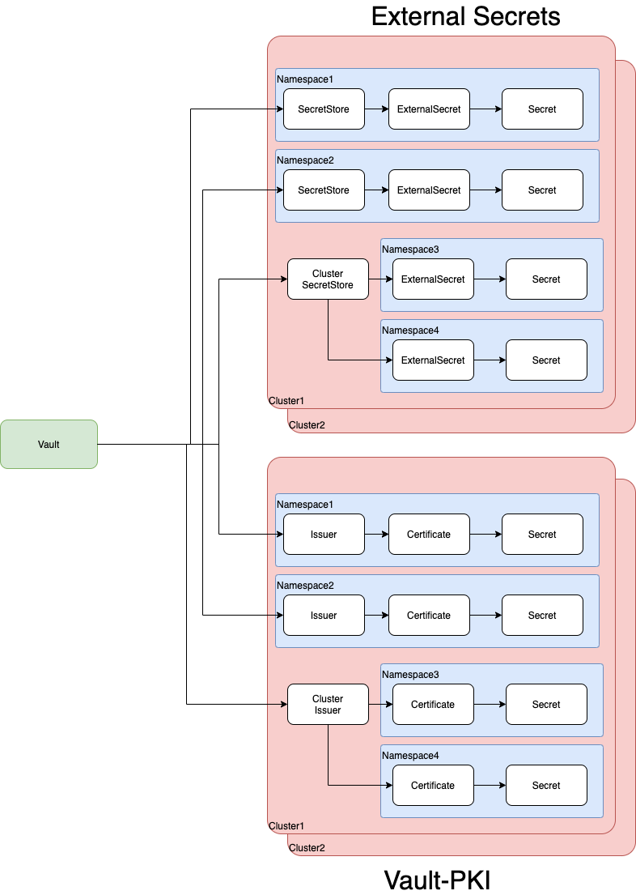

# Vault
# Introduction
The vault deployment is taken in part from the [openshift-modern-availability](https://github.com/raffaelespazzoli/openshift-modern-availability/blob/master/establishing-trust.md) collection of openshift applications and tools. Modifications have been made to automate it through gitops and fit the OTP pattern.


Vault is primarily being used to provide a key-value store for secrets, used in conjunction with the external-secrets tool allows for secrets to be centralised in cloud provider agnostic and decentralised method. The vault installation is setup to be deployed on 3 (this could be increased) fixed pre-determined clusters. ideally a cluster would be placed in each cloud provider to cover of an outage in the other provider.

Each cluster has 3 vault nodes running, in total there are 9 vault nodes running and communicating with each other.

Data is stored in each persistent volume, attached to each node.

# Installation
Installation is managed through argocd, access and some minor local cluster customization is configured automatically. Currently a kustomization file needs to be updated to align cluster and dns names across all nodes. 

## Kustomization 
A kustomization is included, which is setup to provide adjust DNS names used in certificates generated and similar for the configuration file.
## Config
What needs to be updated is leader_api_addrs with the address of each vault instance, this can be predetermined before deployment, the same config file is for each deployment.

## Initialisation
**Currently this process is not automated**

Once the cluster(s) are installed vault needs to be initialised, this will generate the unseal keys and root token, which should be kept safely and securely somewhere else. 

Note: The following examples are being executed from within a vault pod.

```
vault operator init -address https://vault-0.cluster1.vault-internal.vault.svc.clusterset.local:8200 -ca-path /etc/vault-tls/ca.crt -format=json -recovery-shares 1 -recovery-threshold 1)

{
  "unseal_keys_b64": [
    "ZZQUCgCgpNXBcjTfbUd2_fsdfsdNUFpGUgMsXfrnSll09",
    "SM2+jmrucLVAkp5c1fsfsdfsdyD1EzPY5RiHZM21QJMujt",
    "sWGW+qM5Uony8IQjWUOsdfsdf++sdNNPW3+zWNWktmbFn6",
    "9woSe0R1hlhtx9lkfsd0M<se6S7r+AB/6nW1ps8oMJLOYO",
    "YJc4jSDybx2jFR2342342fdsfo7uBeWvJuzmE6iRROX7sP5"
  ],
  "unseal_keys_hex": [
    "6594140a0234423464345343677744b8b5048ec35416919480cb177eb9d2965d3d",
    "48cdbe8e6aee70b54092234252326588f2cf1c831333d8e5188764cdb540932e8ed",
    "b16196faa3395289f2f084235dsfgdf225b0164884d34f5b7fb358d5a4b666c59fa",
    "f70a127b4475212325c7db8fc602342s9ee92eebf8007fea75b5a6cf283092ce60e",
    "62342342527f26f1da315146159b0340bca3bb81796bc9bb3984ea2451397eec3f9"
  ],
  "unseal_shares": 5,
  "unseal_threshold": 3,
  "recovery_keys_b64": [],
  "recovery_keys_hex": [],
  "recovery_keys_shares": 1,
  "recovery_keys_threshold": 1,
  "root_token": "s.zdfgsd234h8lK3mfmcvOquwD0li"
}

```
## Unsealing
**Currently this process is not automated**

The vault will be initalised in a sealed state, **each** node needs to be unsealed for it to join the cluster. 
The unseal keys generated in the initialisation are used for this purpose. 

The following command is used to unseal, its is being issued from within a Vault pod. After issuing the command you will be prompted for an unseal key, you can chose any one of the 5 keys generated. This will need to be performed 3 times, each time using a different unseal key. 

You can unseal the other vaults from the same pod its not necessary to change pods or clusters.

```
vault operator unseal -address https://vault-2.azure0.vault-internal.vault.svc.clusterset.local:8200 -ca-path /etc/vault-tls/ca.crt
```

Background information on vaults sealing and unsealing https://www.vaultproject.io/docs/concepts/seal

## Cluster Health
To check the status of the cluster use the following

``` 
vault operator raft list-peers -address https://vault-0.aws1.vault-internal.vault.svc.clusterset.local:8200 -ca-path /etc/vault-tls/ca.crt
Node              Address                                                          State       Voter
----              -------                                                          -----       -----
vault-0-aws0      vault-0.aws0.vault-internal.vault.svc.clusterset.local:8201      leader      true
vault-1-aws0      vault-1.aws0.vault-internal.vault.svc.clusterset.local:8201      follower    true
vault-2-aws0      vault-2.aws0.vault-internal.vault.svc.clusterset.local:8201      follower    true
vault-0-aws1      vault-0.aws1.vault-internal.vault.svc.clusterset.local:8201      follower    true
vault-1-aws1      vault-1.aws1.vault-internal.vault.svc.clusterset.local:8201      follower    true
vault-2-aws1      vault-2.aws1.vault-internal.vault.svc.clusterset.local:8201      follower    true
vault-1-azure0    vault-1.azure0.vault-internal.vault.svc.clusterset.local:8201    follower    true
vault-0-azure0    vault-0.azure0.vault-internal.vault.svc.clusterset.local:8201    follower    true
vault-2-azure0    vault-2.azure0.vault-internal.vault.svc.clusterset.local:8201    follower    false
```

## Backing Storage
Vault uses the default storageclass for creating its PVCs.
## Communications
The deployment takes advantage of submariner (also part of the OTP pattern) to create Layer 3 tunnels using IPSec to create a secure and consistent (in naming and behavior) connection between clusters.

The Vault nodes are configured in a mesh, i.e all nodes talking to all nodes.
## TLS
TLS certificates are used between each node. Their creation is handled by a local instance of cert-manager using a self signed CA, that is acting as an intermediate CA for that cluster and namespace. Refer to the cert-manager [README.md]( https://github.com/nickmerrett/otp-gitops-services/tree/master/instances/cert-manager) for more details.

Certificates are also created for the routes created for external access, the certificates when created should also include DNS names for all possible external URLs. These certificates are generated off the self-signed CA and thus will come up as untrusted/unsafe in web browsers. Applications accessing the vault including, cert-manager and external-secrets will likely need to have CA bundles supplied in order for them to open a trusted TLS connection to the vault.

## External Load Balancer

## Health Checks
Health checks can be configured to check the /v1/sys/health path, the checks are quite detailed, as vault has a number of states. 

The main states to check are;
 - "sealed" should be false for normal operation 
 - standby should be false for normal operation

```
{
   "cluster_id" : "3be39c7b-ac4f-c6f4-9af5-971af551ee0f",
   "cluster_name" : "vault-cluster-0b87b658",
   "initialized" : true,
   "performance_standby" : false,
   "replication_dr_mode" : "unknown",
   "replication_performance_mode" : "unknown",
   "sealed" : false,
   "server_time_utc" : 1644293075,
   "standby" : true,
   "version" : "1.8.1"
}
```
Refer to Vault's docs for more details https://www.vaultproject.io/api-docs/system/health

# Use
Vault is used in 2 ways for the OTP pattern;
- Secrets
- PKI Certificate Authority

The diagram  below shows the relationship to the ExternalSecrets operator and Cert-Manager vault PKI integration. One thing to note the SecretStore and Issuer can either be namespace defined (and thus locked) or global to the cluster.


